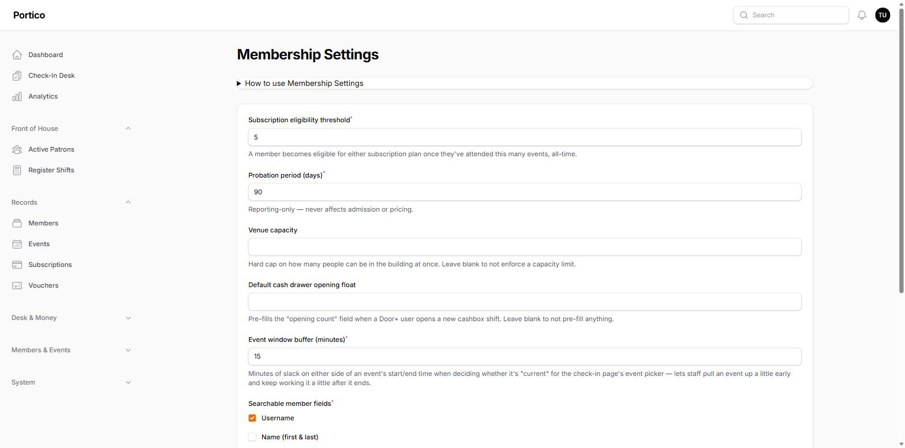
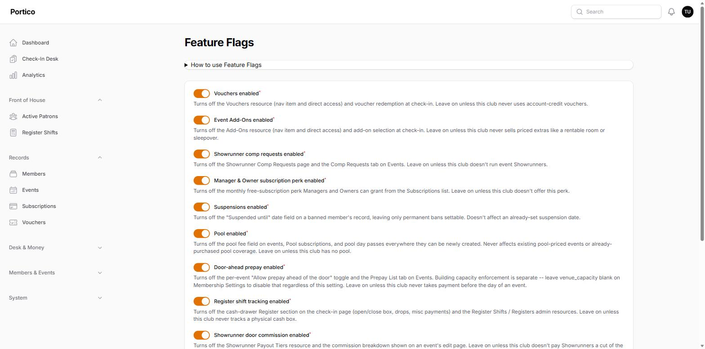

# Configuring Portico for your club

`php artisan migrate:fresh --seed` ships a deliberately small starter set — membership
categories, an `event_types` list, example subscription plans, a few `comp_reasons`,
paperwork types, and payout tiers. **Almost everything below is edited in the admin panel
at runtime** by a Manager, Admin, or Owner — no code change, no redeploy. Set the handful
of `.env` values, then work through the settings screens once.

See also: [`README.md`](../README.md) (install), [`docs/DEPLOYMENT.md`](DEPLOYMENT.md) (LAN
deployment), [`docs/BLUEPRINT.md`](BLUEPRINT.md) (the domain rules), and
[`docs/FEATURES.md`](FEATURES.md) (feature inventory).

---

## Name & branding

- **`APP_NAME`** in `.env` — used in the browser tab, mail, and as the panel brand by
  default.
- **Displayed organization name** on `/admin/membership-settings` (`org_name`, Owner only)
  — overrides the panel brand shown in the sidebar without touching `APP_NAME`. Leave it
  blank to fall back to `APP_NAME`.
- The admin footer links to the canonical Portico repository. If you deploy a **modified**
  version, the AGPL requires you to offer that source to your users — point the link at
  your own fork (`resources/views/filament/admin/footer.blade.php`).

## Roles & their labels

Seven fixed, nested roles — `Showrunner ⊂ Volunteer ⊂ DM ⊂ Door ⊂ Manager ⊂ Admin ⊂
Owner` — enforced with plain Laravel policies and gates keyed on `users.role`. There is no
permissions package and the hierarchy is not configurable.

What *is* configurable is the **display name** of each role. `/admin/role-labels`
(Manager+) aliases what staff see without changing the enum cases, the hierarchy, or a
single gate. `Showrunner` and `DM` ship with generic defaults ("Event Lead" and "Monitor")
precisely so a club that dislikes that jargon can rename them.

Create real staff accounts under **Users** (`/admin/users`, Admin+) and stop using the
seeded admin login for day-to-day work.

## Settings screens

All are Manager+ unless noted. They're grouped in the left nav exactly as listed here.

### Desk & Money

| Screen | What it's for |
|---|---|
| **Subscription Plans** | Regular / Pool plan price and per-visit credit, effective-dated — edit the price and a new row takes effect without rewriting history. |
| **Payment Methods** | The tender types offered at check-in. `code` is immutable once created (historical rows store it). `requires_register_shift` marks a method that needs an open cash drawer and counts toward reconciliation. `one_time_only` marks a method usable once per member ever (e.g. a promo). |
| **Add-Ons** | Priced extras sold at check-in (room rental, sleepover, …). `subscribable` gives an add-on a monthly plan + day pass (this is how Pool works). `is_overnight` keeps a guest visible on Active Patrons past their event. An add-on can be waiver-gated via Paperwork Types. |
| **Comp Reasons** | The reasons a Manager can waive one visit's entry fee. Ships with Presenter, Volunteer, and Guest of a staff member. A `grants_voucher_amount` auto-issues a reward voucher once that event ends (run `vouchers:grant-comp-rewards`). |
| **Registers** | The physical cash drawers/tills. Only relevant if `register_shifts_enabled`. |
| **Cleaning Tasks** | The checklist items on the Cleaning Checklist page. |

### Members & Events

| Screen | What it's for |
|---|---|
| **Categories** | Membership categories and their flags (`is_comped` = never charged entry). **Prospective, Guest, and Irregular are protected** — business logic matches them by name, so they can't be renamed or deleted (everything else about them is editable). |
| **Paperwork Types** | Waivers/forms a member signs. `required`, `renewal_months`, and `gates_add_on_id` (e.g. a Pool Waiver that gates the Pool add-on). |
| **Skills** | A tag catalog (e.g. "First aid", "DJ"). Assigning a skill to a member is Admin+; editing the catalog is Manager+. |
| **Event Types** | Social, Class, Munch, … Each event picks one. Its **Instructor Pay Rates** tab sets per-head instructor pay (only if `instructor_payouts_enabled`). |
| **Showrunner Payout Tiers** | Headcount → commission bands for the Showrunner cut of the door (only if `showrunner_payouts_enabled`). |

### System

| Screen | What it's for |
|---|---|
| **Users** | Staff accounts and their role. Password strength is enforced; you can't lock yourself or the last Owner out. |
| **Feature Flags** | Turn optional features on/off — see below. |
| **Membership Settings** | The operational tunables — see below. |
| **Role Labels** | Per-role display-name aliases — see "Roles" above. |
| **Technical** | Environment info and last-run status of the scheduled commands, with buttons to run the backup and comp-reward jobs on demand. |

## Membership Settings

`/admin/membership-settings` (Manager+). Every value is seeded from a sensible default; you
rarely need to touch most of them.



| Setting | Default | Notes |
|---|---|---|
| Subscription eligibility threshold | `5` | Attended-events count that unlocks a subscription. |
| Probation period (days) | `90` | Reporting-only — never blocks admission or changes pricing. |
| Venue capacity | *(blank)* | Building-wide occupancy cap across concurrent events. **Blank = not enforced.** |
| Default cash drawer opening float | *(blank)* | Pre-fills the opening count when a shift is opened. |
| Event window buffer (minutes) | `15` | Slack around an event's start/end for the check-in picker (also handles an event running past midnight). |
| Displayed organization name | *(blank)* | Panel brand override — see "Name & branding". |
| Searchable member fields | `Username` | Which fields the member search boxes match on, and what shows in member dropdown labels. |
| Hide personal info by default on the Members list | on | Whether the Members table masks name/DOB/email until "Show personal info". |
| Showrunner commission includes pool / add-on revenue | off / off | Whether those revenue lines count toward the Showrunner's door cut. |

## Feature Flags

`/admin/feature-flags` (Manager+). Every flag defaults **on**. **A flag stops *new* writes
— it never hides data already collected**, so turning one off after use leaves existing
records intact and reviewable.



| Flag | Off means |
|---|---|
| Vouchers | No Vouchers resource and no voucher redemption at check-in. |
| Event Add-Ons | No Add-Ons resource and no add-on selection at check-in. |
| Showrunner comp requests | No Showrunner Comp Requests page or Comp Requests tab on Events. |
| Manager & Owner subscription perk | No monthly free-subscription grant from the Subscriptions list. |
| Suspensions | No "Suspended until" date on a banned member — permanent bans only. |
| Pool | No pool fee on events, Pool subscriptions, or pool day passes for anything newly created (existing pool coverage is untouched). |
| Door-ahead prepay | No per-event "Allow prepay ahead of the door" toggle or Prepay List tab. |
| Register shift tracking | No cash-drawer section at check-in and no Register Shifts / Registers resources. |
| Showrunner door commission | No Showrunner Payout Tiers resource or commission breakdown on events. |
| Instructor per-head pay | No Instructor Pay Rates tab on Event Types or instructor payout breakdown. |
| Patron visit notes | No visit-note column on Active Patrons. |
| Patron behavior notes | No adding new behavior notes on Active Patrons (existing ones stay reviewable by Manager+). |

## `.env` you'll actually set

Most of `.env.example` is stock Laravel. The values that matter for a real install:

```
APP_NAME="Your Club"
APP_ENV=production
APP_DEBUG=false
APP_URL=http://checkin.yourclub.lan
APP_TIMEZONE=America/Chicago          # your local zone

DB_DATABASE=portico
DB_USERNAME=portico
DB_PASSWORD=...

# Required outside local/testing — the seeder refuses to ship a guessable admin.
ADMIN_EMAIL=you@yourclub
ADMIN_PASSWORD=a-real-password

WATCHLIST_NOTIFY_LABEL="your #members channel"   # wording in the admission warning
SYSTEM_USER_EMAIL=system@yourclub.internal       # attributes automated grants

BACKUP_DESTINATION="D:/backups/portico"          # a folder that syncs off the machine
BACKUP_PREFIX=yourclub
# MYSQLDUMP_PATH="C:/Program Files/MariaDB 12.3/bin/mysqldump.exe"

MAIL_MAILER=log     # deferred — post-event notifications only deliver once you wire a real transport
```

## Scheduled commands

Portico has **no Laravel scheduler**. Register each recurring job on a timer (Windows Task
Scheduler or cron) — see [`docs/DEPLOYMENT.md`](DEPLOYMENT.md) §3:

| Command | Cadence |
|---|---|
| `php artisan backup:database` | nightly |
| `php artisan events:notify-ended` | hourly |
| `php artisan vouchers:grant-comp-rewards` | hourly |

## Your first week

1. Set real **Subscription Plan** prices and review **Categories** / **Event Types**.
2. Create real **Users** for your staff; stop using the seeded admin for daily work.
3. Review **Feature Flags** — turn off anything your club doesn't do.
4. Want to explore with realistic data first? Run `php artisan db:seed --class=DemoDataSeeder`
   **on a scratch database only** — never the one you'll go live on.
